# Overview

The [`xod/graphics`](https://xod.io/libs/xod/graphics) library provides a standard set of nodes to create graphics and graphic interfaces. This library describes various geometric and graphical objects and contains their rasterization and rendering methods, which are required for subsequent display on LCDs or OLEDs.

The `graphics` is responsible for building the scene of the image and it should work in conjunction with the display library. To display the finished image on the screen of a particular display, you should use the XOD library of this display.

## Coordinate system and units

A digital picture consists of pixels. A pixel is the smallest logical element of an image in raster graphics, as well as a physical element of the matrix of displays. Pixel is a two-dimensional element. It has two coordinates (X, Y) in a two-dimensional coordinate system. Traditionally, the origin (0, 0) of the coordinate system for an image or graphic display is at the top-left corner.

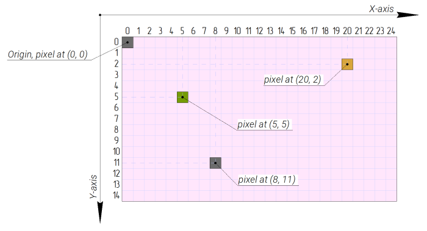

Pixel coordinates are integer values. In XOD, pixel coordinate values are of the [Number](/docs/reference/data-types/#number-literals) type i.e., floating-point values and are round to the minimum integers. For example, a pixel specified as (5.89, 2.02) is displayed on the screen as (5, 2).

In addition to coordinates, each pixel has its color. In XOD the color of a pixel is set by a value of the [Color](/docs/reference/data-types/#color-literals) type i.e. by 3 bytes, one for each component R, G, and B. This color type has a color depth named [true color](https://en.wikipedia.org/wiki/Color_depth#True_color_(24-bit)) and has a palette of 16,777,216 colors. However, not every display can handle so many color variations. For example, the [ST7735 display](/docs/guide/st7735-displays/) operates the [high color](https://en.wikipedia.org/wiki/High_color) color depth with the palette of 65,536 colors, while the [SSD1306 display](/docs/guide/ssd1306-displays/) is monochrome and operates only black and white color. In XOD, the pixel color is reduced to the acceptable resolution for a particular display.

## Canvas

The building process of any scene begins with the `canvas` node. It is the entry point and the first object in the tree of graphic elements of the scene.
Physically `canvas` defines a specific area on the display screen that is subjected to the rendering process.

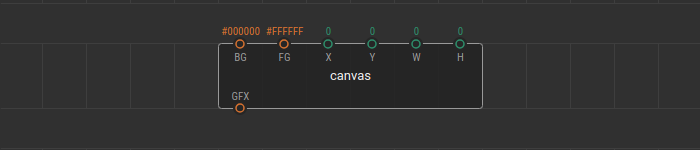

Сanvas has a rectangular shape. It is defined by the pivot point (`X`, `Y`), which is its upper-left vertex, width `W` , and height `H` in pixels. 
The pivot point of the canvas is a specific pixel on the matrix of a display and its coordinates are related to the display matrix coordinate system.

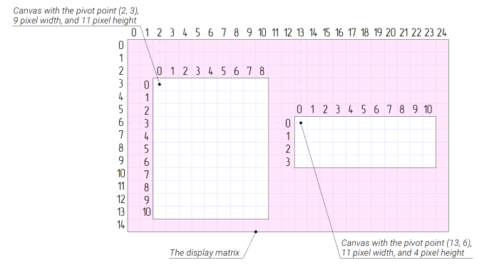

Canvas can take up the entire display matrix or be a part of it. The display matrix may contain several `canvas` at the same time.
When initialized, the canvas forms a new coordinate system within itself. This new system is used to position all subsequent graphic elements in the tree of the scene.

Note
In XOD, the position of any graphic element is determined by its coordinates on the canvas and not the screen!

A value at the `BG` pin of the `canvas` node sets the background color for all pixels in the selected area of the screen. The `FG` pin value sets the foreground color of the scene. This color is the default for all subsequent graphic elements located on the canvas.

## Scene as a tree

The image scene is a tree of various graphic elements (geometric objects, text, bitmap images, and icons) that lie on a `canvas`.

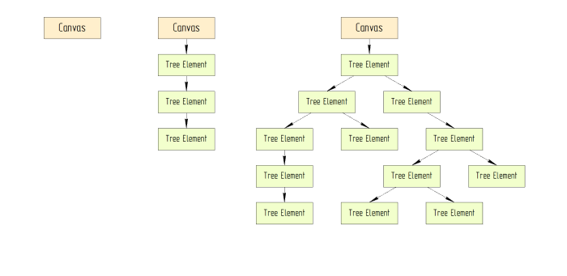

A tree can have no elements or be strictly sequential or expand and form new branches. The order in which the elements of the graphical tree are located determines the order in which these elements are displayed on the screen. Amongst themselves, tree elements link through the `GFX` node pins.

To show the image on the screen of the device, it should be rendered. For this, the `render` node is used. 

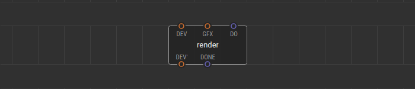

The `render` node is a kind of "end of the tree branch". On a `pulse` signal this node processes one branch of the graphic tree for a given `canvas` and displays the resulting image on the screen.

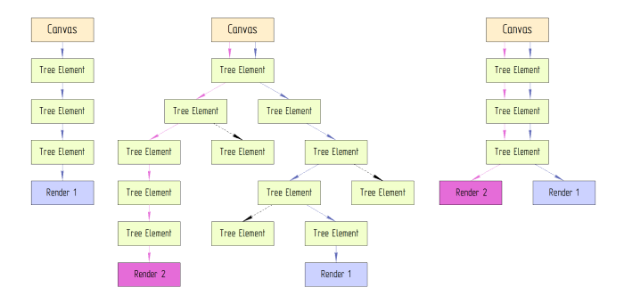

Each branch of the tree can be rendered independently of other branches. A single tree branch can be linked to multiple `render` nodes to be displayed on different devices.
The rendering process is different for each specific display device so in XOD, each display library contains its own `render` node. 

## Graphic elements

Each graphic element has its node. Graphical elements in XOD are dynamic; i.e., they can change all their properties in real-time.

## Geometric objects

### Point

It is the most basic graphic element. Point is set on canvas by coordinates (`X`, `Y`).

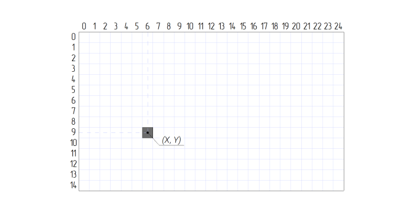

The `point` node describes a point with a thickness of 1 pixel and the default foreground color of the scene.
You can set any color for a point using the `point-colored` node.

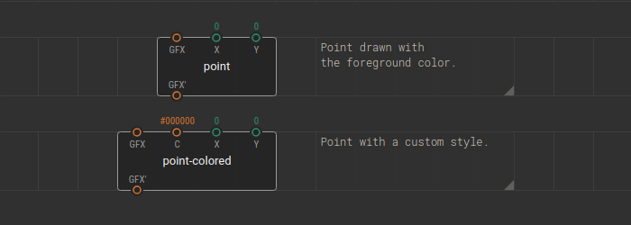

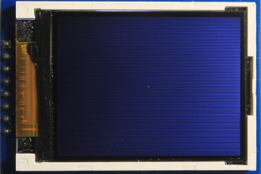

### Line

The line is set on canvas by two points, the start point (`X0`, `Y0`) and the endpoint (`X1`, `Y1`). The order of points can be any.

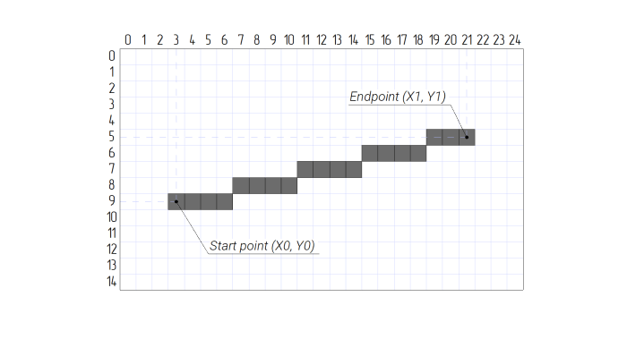

The `line` node describes a line with a thickness of 1 pixel and the default foreground color of the scene.
You can set any color for a line using the `line-colored` node.

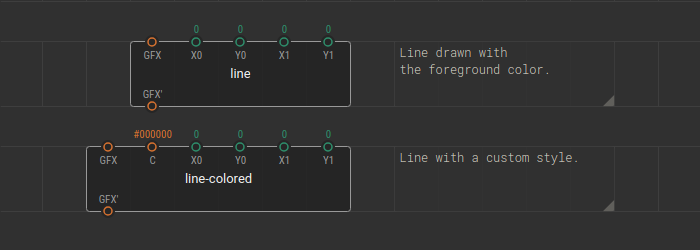

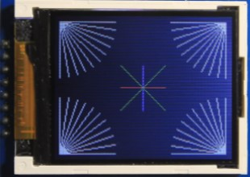

### Rectangle

The rectangle is set on canvas by a pivot point (`X`, `Y`), which is its upper-left vertex, width `W`, and height `H`.

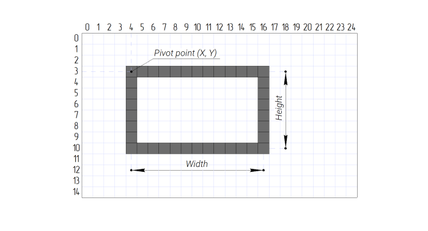

A rectangle can be filled in with a solid color or represent an unfilled rectangle frame.
Filled and non-filled rectangles have a different set of nodes.

The `rect-outline` node describes a rectangle frame with a thickness of 1 pixel and the default foreground color of the scene.
You can set any color for a frame using the `rect-outline-colored` node.

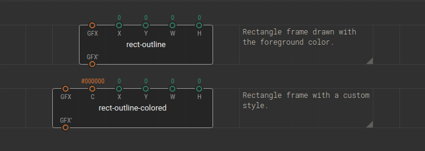

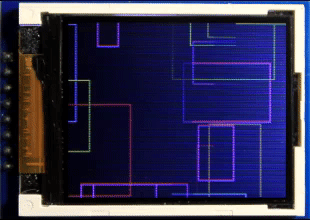

The `rect-solid` node describes a rectangle filled with a solid default foreground color of the scene.
You can set any fill color for a rectangle using the `rect-solid-colored` node.

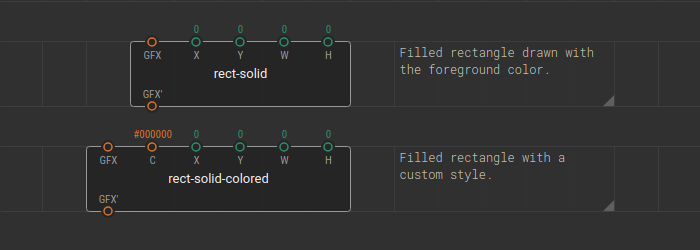

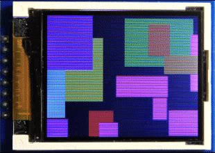

### Circle

The circle is set on canvas by a center point (`X`, `Y`), and radius `R`.

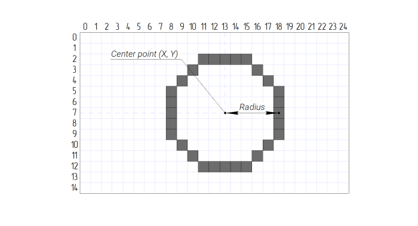

A circle can be filled in with a solid color or represent an unfilled circle frame.
Filled and non-filled circles have a different set of nodes.

The `circle-outline` node describes a circle frame with a thickness of 1 pixel and the default foreground color of the scene.
You can set any color for a frame using the `circle-outline-colored` node.

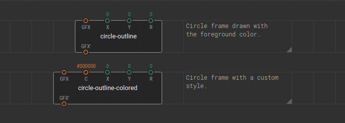

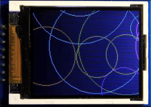

The `circle-solid` node describes a circle filled with a solid default foreground color of the scene.
You can set any fill color for a circle using the `circle-solid-colored` node.

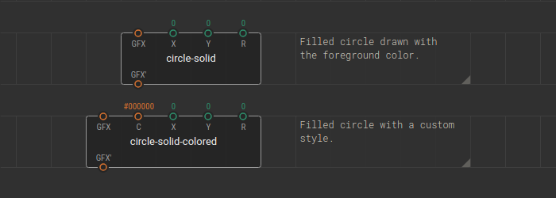

### Triangle

The triangle is set on canvas by three points (`X0`, `Y0`), (`X1`, `Y1`), and (`X2`, `Y2`). The order of points can be any.

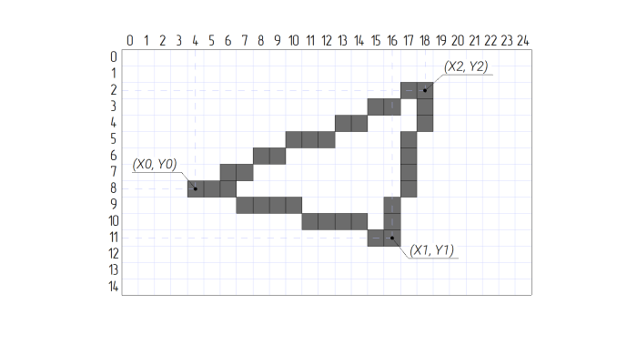

A triangle can be filled in with a solid color or represent an unfilled triangle frame.
Filled and non-filled triangles have a different set of nodes.

The `triangle-outline` node describes a triangle frame with a thickness of 1 pixel and the default foreground color of the scene.
You can set any color for a frame using the `triangle-outline-colored` node.

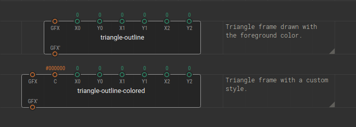

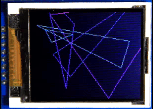

The `triangle-solid` node describes a triangle filled with a solid default foreground color of the scene.
You can set any fill color for a triangle using the `triangle-solid-colored` node.

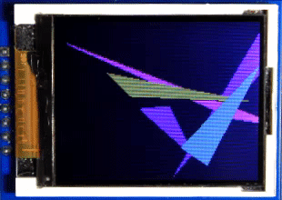

## Text

You can display various text strings on the screen. 

Currently, the only font supported for the drawing a text is the same that is used in the firmware of sign-generating displays. This font has a dimension of 5x7 pixels.

The text string is set on canvas by the start point, which is the upper-left vertex of the first character in a string.

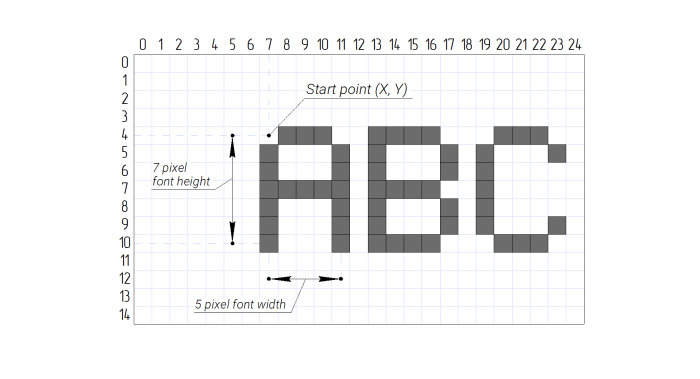

To define the text string the `text` and `text-colored` nodes are used. 

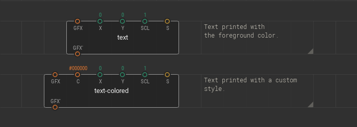

The `text` node displays a [String](/docs/reference/data-types/#string-literals) specified at the `S` pin with the default foreground color of the scene.

By the `text-colored` node you can set a string of any color.

Text can be scaled using the `SCL` pin. The resulting text is scaled N times, where N is the integer value specified at the `SCL` pin.

## Pictures

